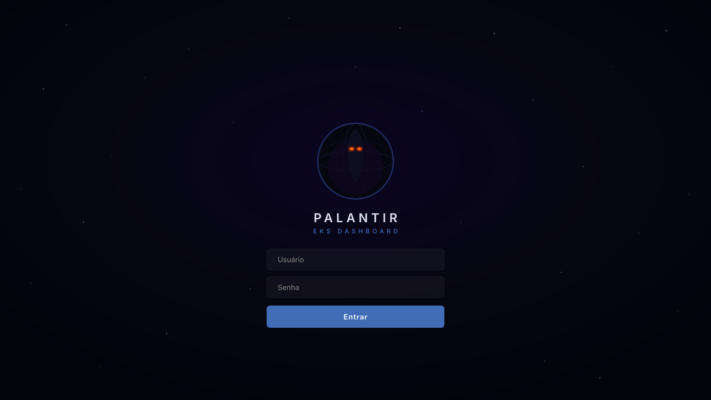
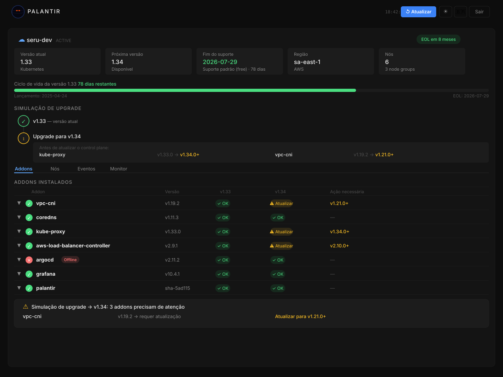

<p align="center">
  
</p>

<p align="center">
  <em>One dashboard to rule them all</em>
</p>

<br/>

# Palantir — EKS Dashboard

Dashboard para visualizar versão do cluster EKS, fim do suporte, addons instalados e compatibilidade com a próxima versão do Kubernetes.

## Screenshots

<p align="center">
  
  
</p>

> **Login** — tela de entrada com animação do orb Nazgûl e campo de estrelas · **Dashboard** — visão completa do cluster com addons, simulação de upgrade, ciclo de vida, node groups, eventos K8s e monitor de CPU/memória

## Requisitos

- Docker e Docker Compose instalados
- Kubeconfig com acesso ao cluster EKS
- Credenciais AWS configuradas (para o boto3 consultar o EKS via API)

## Como usar

```bash
# 1. Clone o projeto
git clone <seu-repo>
cd eks-dashboard

# 2. Copie o .env
cp .env.example .env

# 3. Suba os containers
docker compose up --build

# 4. Acesse no browser
http://localhost:5173
```

## Fluxo

1. Faça upload do kubeconfig pela interface
2. O backend carrega em memória (nunca salva em disco)
3. O dashboard exibe versão, EOL, addons e compatibilidade com a próxima versão
4. Clique na seta de cada addon para ver detalhes, links e acesso à UI (se tiver)

## Estrutura

```
eks-dashboard/
├── docker-compose.yml
├── backend/              # FastAPI + kubernetes SDK + boto3
│   ├── app/
│   │   ├── routers/      # cluster, addons, access
│   │   ├── services/     # k8s.py, eks.py, compatibility.py
│   │   └── models/       # Pydantic models
│   └── main.py
└── frontend/             # React + Vite
    └── src/
        ├── components/   # ClusterCard, AddonTable, AddonRow, AccessBox...
        ├── hooks/        # useCluster, useAddons
        └── api/          # client.js (axios)
```

## Adicionando novos addons

Para adicionar compatibilidade de um novo addon, edite dois arquivos:

**`backend/app/services/compatibility.py`**
```python
COMPATIBILITY["meu-addon"] = {
    "1.28": "ok",
    "1.29": "min:2.0.0",
}

ADDON_META["meu-addon"] = {
    "has_ui": True,
    "maintainer": "...",
    "category": "...",
    "description": "...",
    "doc_url": "...",
    "changelog_url": "...",
    "github_url": "...",
}
```

**`backend/app/routers/access.py`** (se tiver UI)
```python
ADDON_SERVICE_MAP["meu-addon"] = {
    "namespace": "meu-namespace",
    "service": "meu-service",
    "port": 8080,
}
```
